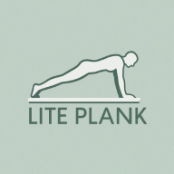

# LitePlank - Планка трекер

Простое и удобное приложение для тренировок планки. Следите за своими результатами, считайте калории и отслеживайте прогресс.


[](https://dmtrmnv.github.io/liteplank/)

## 🚀 Быстрый старт

1. **Откройте приложение** в любом браузере
2. **Установите как PWA** - добавьте на главный экран вашего устройства
3. **Настройте профиль** - укажите вес, рост, пол и возраст
4. **Начните тренироваться** - запускайте таймер и удерживайте планку.

## 📱 Что умеет LitePlank

### ⏱️ Таймер планки
- Точный таймер с настройкой времени (от 1 секунды до 1 часа)
- Звуковой и вибрационный сигналы по окончании
- Возможность досрочного завершения
- Автоматическое сохранение результатов

### 💪 Выбор вида планки
- 5 встроенных видов планки с разными значениями MET
- Каждая планка имеет свой коэффициент нагрузки
- Автоматический расчет калорий в зависимости от выбранной планки
- Легкое добавление новых видов планки через JSON файлы

### � История тренировок
- Сохранение всех тренировок с датой и временем
- Просмотр последних 10 тренировок
- Статистика: общее время, среднее время
- Возможность удаления отдельных тренировок

### �🔥 Расчет калорий
- Автоматический расчет сожженных калорий
- Индивидуальный расчет на основе вашего веса
- Показатель "Удержано кг" - ваш общий "вес" и количество тренировок

### 📅 Календарь тренировок
- Визуальный календарь с отметками дней тренировок
- Навигация по месяцам
- Статистика за месяц: количество тренировок, общее время, калории, средняя длительность
- Детальный просмотр тренировок за выбранный день
- Подсветка текущего дня

### 🎨 Дополнительные функции
- Темная и светлая темы
- Поддержка нескольких языков
- Работа в офлайн-режиме
- Автоматическое обновление
- Экспорт и импорт данных

## 🧮 Как рассчитываются калории

LitePlank использует стандартную формулу для расчета сожженных калорий:

```
Калории = (MET × 3.5 × Вес в кг) / 200 × Время в минутах
```

Где:
- **MET** (Metabolic Equivalent of Task) - метаболический эквивалент нагрузки
- Для стандартной планки используется MET = 3.5
- **3.5** расход кислорода в покое (мл/кг/мин) — базовая норма для 1 MET.
- **Вес** - ваш вес, указанный в настройках профиля
- **200** - «сжатый» коэффициент пересчета кислорода в энергию.
- **Время** - продолжительность вашей тренировки

### Что такое "Удержано кг"?
Это показатель вашей общей "работы" - просто вес × количество тренировок. Например:
- Вес: 70 кг
- Тренировок: 10
- Удержано кг: 70 × 10 = 700 кг

Это не реальный вес, а просто интересный показатель для мотивации 😉

## ⚙️ Настройка профиля

Для точного расчета калорий укажите в настройках:
- **Вес** - в килограммах
Остальные параметры также важны для будущих более точных расчетов
- **Пол** - мужской/женский
- **Рост** - в сантиметрах  
- **Возраст** - в годах

Эти данные используются только для расчетов и хранятся локально на вашем устройстве.

## 🌐 Добавление новых переводов

LitePlank поддерживает несколько языков. Хотите добавить свой язык? Это просто!

### 1. Создайте файл перевода

Создайте новый JSON файл в папке `locales/`:

```
locales/
├── ru.json  # Русский (исходный)
├── en.json  # Английский (исходный)
└── ваш-язык.json  # Ваш новый язык
```

### 2. Структура файла перевода

```json
{
  "app": {
    "title": "Название приложения",
    "description": "Описание приложения",
    "loading": "Загрузка..."
  },
  "tabs": {
    "timer": "Таймер",
    "history": "История",
    "settings": "Настройки"
  },
  "timer": {
    "start": "Старт",
    "pause": "Пауза",
    "finish": "Завершить",
    "reset": "Сброс",
    "duration": "Время (сек)"
  }
}
```

### 3. Переведите все ключи

Возьмите за основу существующий файл (например, `en.json`) и переведите все тексты на ваш язык.

### 4. Добавьте язык в интерфейс

Откройте файл `index.html` и найдите секцию выбора языка:

```html
<select id="language-select" class="setting-input">
  <option value="ru" data-i18n="language.ru">Русский</option>
  <option value="en" data-i18n="language.en">English</option>
  <!-- Добавьте ваш язык здесь -->
  <option value="код языка" data-i18n="language.код языка">Ваш язык</option>
</select>
```

✅ Сохраняйте ключи без изменений
✅ Сохраняйте структуру JSON (вложенность объектов)
✅ Переводите только значения (values)
⚠️ Не меняйте специальные символы (emoji, {{параметры}})

Откройте js/i18n.js и добавьте код языка в массив supportedLangs:

```js
constructor() {
this.translations = {};
this.currentLang = 'ru';
this.fallbackLang = 'ru';
this.supportedLangs = ['ru', 'en', 'код языка']; // Добавьте 'код языка'
this.isLoaded = false;
}
```
Добавьте перевод названия языка в ru.json и остальные файлы переводов

```json
"language": {
"title": "Язык",
"ru": "Русский",
"en": "English",
"код языка": "Ваш язык"
}
```

### 5. Тестирование

1. Откройте приложение
2. Выберите ваш новый язык в настройках
3. Проверьте, что все тексты переведены правильно


### Структура файлов
```
├── index.html          # Главная страница
├── style.css          # Стили
├── css/
│   └── calendar.css   # Стили календаря
├── js/
│   ├── app.js         # Основной код приложения
│   ├── i18n.js        # Система переводов
│   ├── planks.js      # Управление видами планок
│   └── calendar.js    # Модуль календаря
├── planks/            # JSON файлы видов планок
│   ├── img/           # Изображения планок
│   ├── elbow_plank.json
│   ├── high_plank.json
│   ├── knee_plank.json
│   ├── raised_leg_plank.json
│   └── side_plank.json
├── locales/           # Файлы переводов
├── service-worker.js  # Service Worker
├── manifest.json      # PWA манифест

```

## 💪 Добавление нового вида планки

Хотите добавить новый вид планки? Это просто! Система спроектирована так, чтобы добавление новых планок требовало минимум усилий.

### 1. Создайте JSON файл планки

Создайте новый файл в папке `planks/` с названием вида планки:

```
planks/
└── new_plank.json  # Ваш новый вид планки
```

### 2. Структура файла планки

Файл должен содержать три обязательных поля:

```json
{
  "id": "new_plank",
  "met": 4.0,
  "image": "new_plank.svg"
}
```

**Поля:**
- `id` — уникальный идентификатор планки (используется для переводов)
- `met` — метаболический эквивалент нагрузки (коэффициент интенсивности)
- `image` — имя файла изображения (опционально, будет искаться в папке `planks/img/`)

### 3. Значения MET для разных видов планок

MET (Metabolic Equivalent) показывает интенсивность упражнения:

| Вид планки | MET | Описание |
|------------|-----|----------|
| Планка на коленях | 2.5 | Для начинающих |
| Классическая планка | 3.5 | Стандартная на локтях |
| Боковая планка | 5 | На одном локте |
| Высокая планка | 4.0 | На прямых руках |
| Планка с поднятой ногой | 4.5 | Усложнённая |

Вы можете определить MET для новой планки на основе этих значений или найти научные исследования для вашего конкретного упражнения.

### 4. Добавьте переводы

Добавьте название планки во все файлы локализации:

**locales/ru.json:**
```json
"plank": {
  "selectPlank": "Выберите планку:",
  "elbow_plank": "Классическая планка",
  "high_plank": "Высокая планка",
  "knee_plank": "Планка на коленях",
  "raised_leg_plank": "Планка с поднятой ногой",
  "side_plank": "Боковая планка",
  "new_plank": "Название вашей планки"
}
```

**locales/en.json:**
```json
"plank": {
  "selectPlank": "Select plank:",
  "elbow_plank": "Elbow Plank",
  "high_plank": "High Plank",
  "knee_plank": "Knee Plank",
  "raised_leg_plank": "Raised Leg Plank",
  "side_plank": "Side Plank",
  "new_plank": "Your Plank Name"
}
```

### 5. Добавьте планку в список загрузки

Откройте файл `js/planks.js` и добавьте ваш файл в массив `plankFiles`:

```javascript
async loadPlanks() {
    const plankFiles = [
        'elbow_plank.json',
        'high_plank.json',
        'knee_plank.json',
        'raised_leg_plank.json',
        'side_plank.json',
        'new_plank.json'  // Добавьте вашу планку
    ];
    // ...
}
```

### 6. Добавьте изображение (опционально)

Если хотите, чтобы рядом с планкой отображалась картинка:
1. Создайте SVG или PNG изображение
2. Поместите его в папку `planks/img/`
3. Укажите имя файла в поле `image` JSON-файла

### Пример добавления "Планки с поднятой рукой"

**Файл `planks/raised_arm_plank.json`:**
```json
{
  "id": "raised_arm_plank",
  "met": 4.2,
  "image": "raised_arm_plank.svg"
}
```

**Добавить в `js/planks.js`:**
```javascript
const plankFiles = [
    // ... существующие файлы
    'raised_arm_plank.json'
];
```

**Добавить в `locales/ru.json`:**
```json
"raised_arm_plank": "Планка с поднятой рукой"
```

**Добавить в `locales/en.json`:**
```json
"raised_arm_plank": "Raised Arm Plank"
```

✅ Готово! Новая планка появится в списке выбора автоматически.

## 🤝 Вклад в проект

Приветствуются любые предложения по улучшению:
- Исправление багов
- Новые функции
- Дополнительные переводы
- Улучшение документации

## 📄 Лицензия

MIT License - см. файл [LICENSE](LICENSE)

---

**LitePlank** - ваш надежный помощник в тренировках планки 💪
